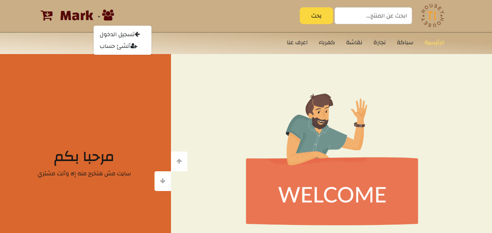
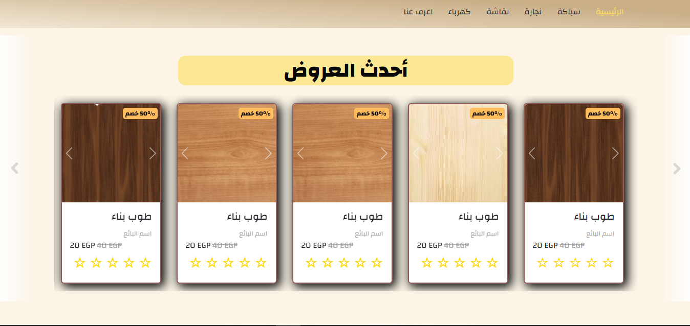
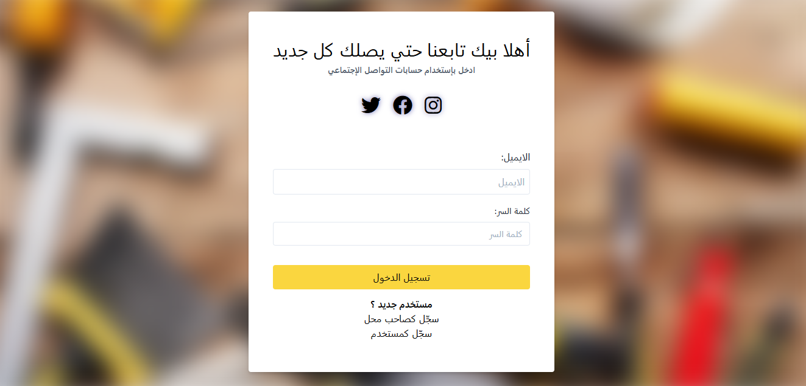
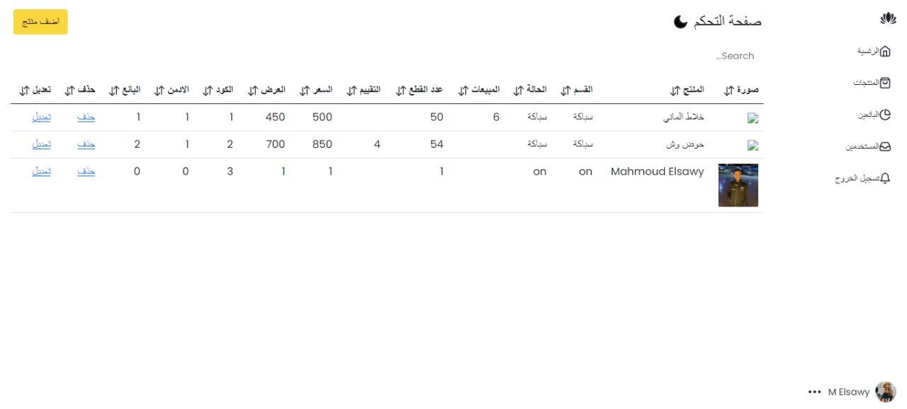
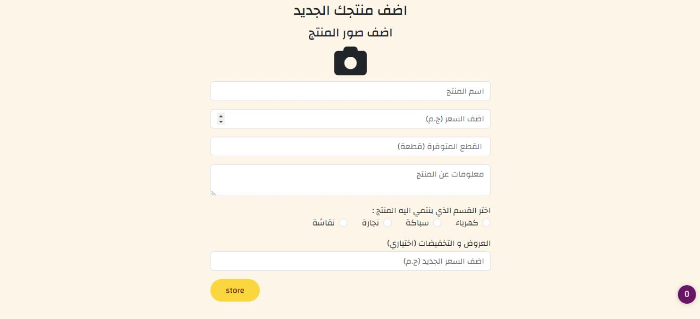

# 🏠 Housey

**Housey** is a website and web application that helps users manage their houses more easily — from organizing daily tasks to tracking household needs and providing quick access to services.

---

## 🖼️ Screenshots

---

## 🔍 Features

- 🏡 Manage household tasks and schedules  
- 👥 Role-based access (Admin, Member)  
- 🔔 Notifications and reminders for tasks  
- 📊 Dashboard with insights and statistics  
- 💻 Responsive design with Bootstrap  

---

## ⚙️ Tech Stack

- **Backend**: PHP (Native)  
- **Frontend**: HTML, CSS, Bootstrap  
- **Database**: MySQL  

---

## 🚀 Getting Started

### Prerequisites

- PHP 7+  
- MySQL  
- XAMPP / WAMP / MAMP (for local development)  

